# Portfolio-Escolar
Este portfólio reunirá todas as tarefas e exercícios realizados durante o ano letivo. Nele, você encontrará uma coleção organizada por disciplinas do curso

---

## Site da Etec 
### 🛠️ Tecnologias utilizadas
- HTML
- CSS
- JavaScript

---

### 📷 Demonstração

Aqui estão alguns prints do projeto:

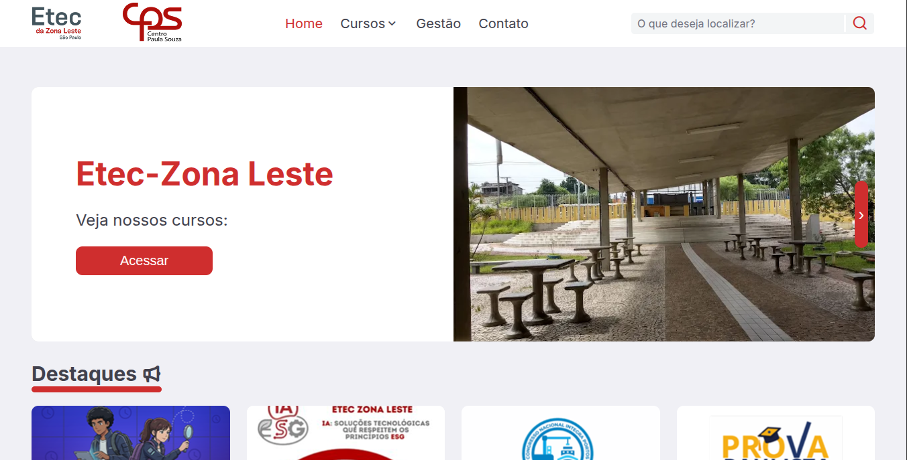
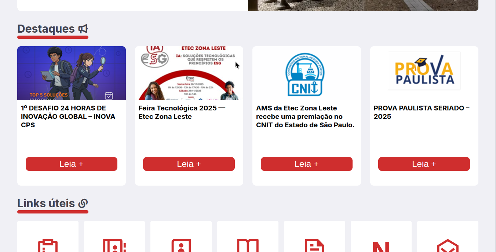
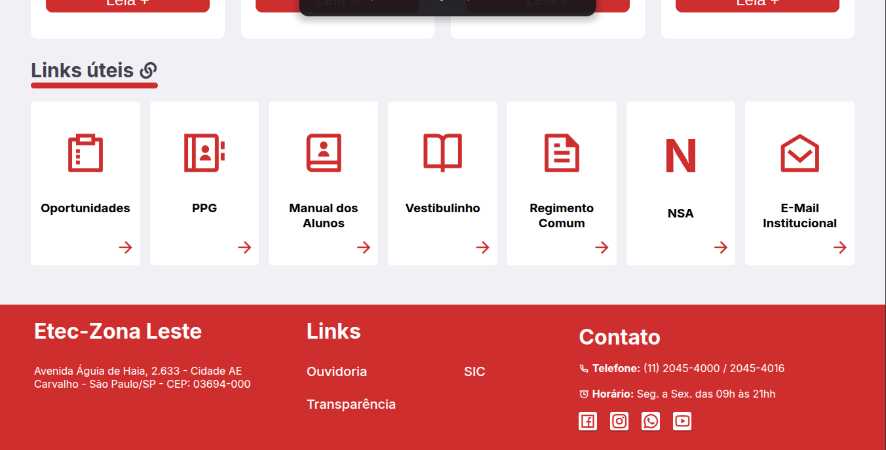
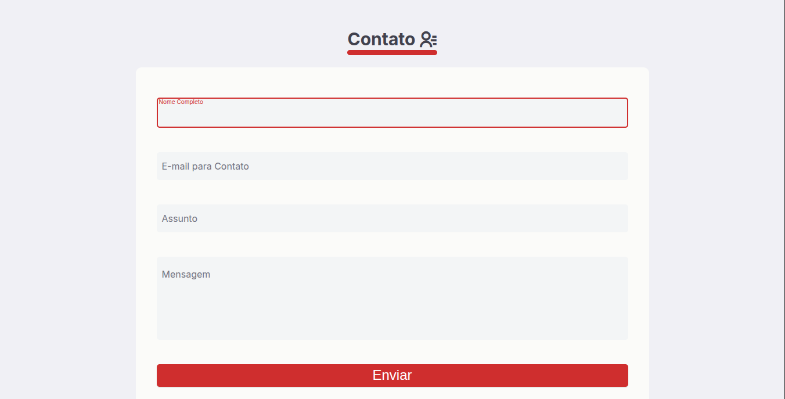
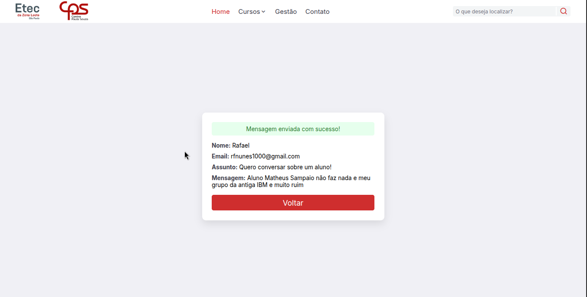
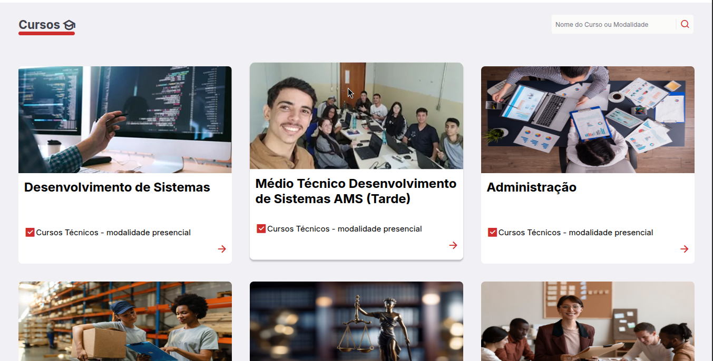
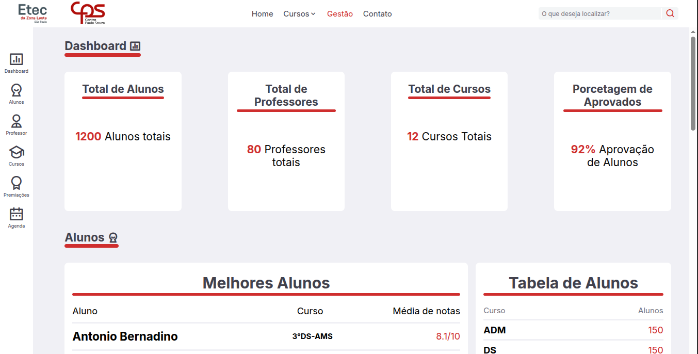
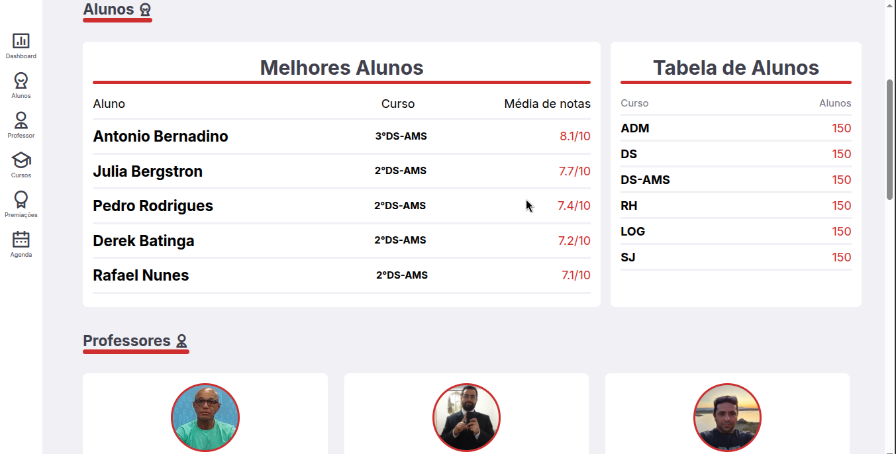
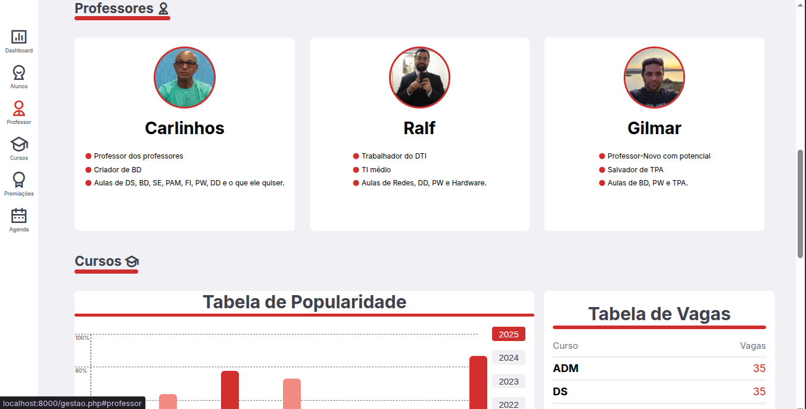
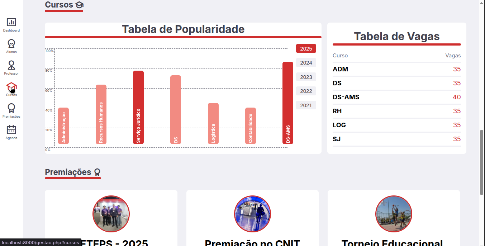
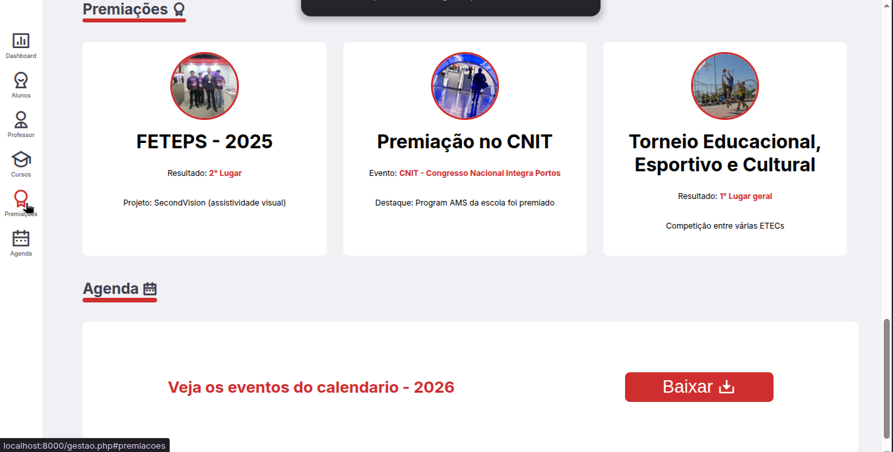

---

### 📌 Observações
Este projeto faz parte das atividades acadêmicas e tem como foco o aprendizado e prática dos conteúdos ensinados em aula.
